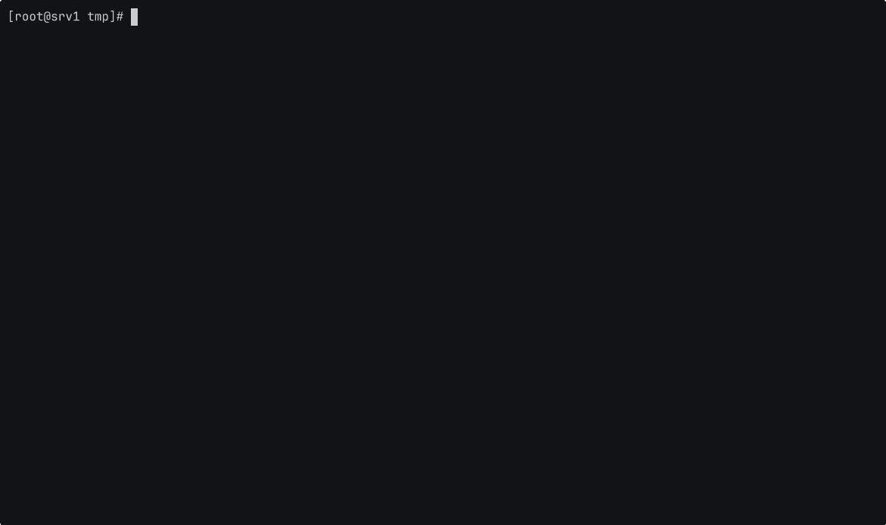

<div align="center">

# oss-stack

**Build your own open-source software stack.**

*Self-host a professional IT infrastructure with the open-source stack we use.*

[Scripts](#scripts) · [Labs](#labs) · [Blocklists](#blocklists) · [Roadmap](#roadmap)

</div>


## What is oss-stack?

oss-stack is a collection of scripts, blocklists, and labs you can run to self-host a professional IT infrastructure.

## What's in this repo?

```
oss-stack/
├── assets/        # Images, diagrams, and branding for docs
├── scripts/       # Deployment scripts for AlmaLinux 10+
├── blocklists/    # Domain and IP blocklists for firewalls, fail2ban, and DNS
└── labs/          # Lab environments to guide you through testing the stack
```

## Who is this for?

oss-stack is a good fit if you:

- Run on-premises infrastructure and want reproducible, auditable deployments
- Need to stand up internal tools — ITSM, monitoring, identity, wiki, SIEM — without paying for SaaS
- Are building a homelab or a customer environment and want a solid, known-good starting point
- Want to teach or demo open-source stacks without spending hours on documentation


## Why not use containers exclusively?

Running services directly on the OS removes an abstraction layer between you and what you're managing. You get native systemd integration, standard log paths, and services that behave exactly as upstream documented — nothing in between. That means more control over configuration, easier troubleshooting, and a clearer picture of what's actually running on your system.
Some projects in this repo may only be available as containers. Where that's the case, containers are used. But when a native install is viable, that's the default.


## Scripts



Run as `root` on a fresh **AlmaLinux 10** server. Each script prompts for the required inputs — language, IP, FQDN — and handles the rest.

> [!NOTE]
> Expand each service to reveal the one-line install command.

#### Group 1 — Core services

<details>
<summary><b>Prep Almalinux 10</b> — Container</summary>

```bash
bash <(curl -fsSL https://raw.githubusercontent.com/runtechx/oss-stack/main/scripts/prep-lcx_al10.sh)
```

</details>

<details>
<summary><b>FreeIPA</b> — identity & DNS</summary>

```bash
bash <(curl -fsSL https://raw.githubusercontent.com/runtechx/oss-stack/main/scripts/freeipa_al10.sh)
```

</details>

<details>
<summary><b>Keycloak</b> — SSO & IAM</summary>

```bash
bash <(curl -fsSL https://raw.githubusercontent.com/runtechx/oss-stack/main/scripts/keycloak_al10.sh)
```

</details>

<details>
<summary><b>NetBox</b> — network source of truth</summary>

```bash
bash <(curl -fsSL https://raw.githubusercontent.com/runtechx/oss-stack/main/scripts/netbox_al10.sh)
```

</details>

<details>
<summary><b>Passbolt</b> — team password manager</summary>

```bash
bash <(curl -fsSL https://raw.githubusercontent.com/runtechx/oss-stack/main/scripts/passbolt_al10.sh)
```

</details>

#### Group 2 — Operations

<details>
<summary><b>Zabbix</b> — infrastructure monitoring</summary>

```bash
bash <(curl -fsSL https://raw.githubusercontent.com/runtechx/oss-stack/main/scripts/zabbix_al10.sh)
```

</details>

<details>
<summary><b>Wazuh</b> — SIEM & XDR</summary>

```bash
bash <(curl -fsSL https://raw.githubusercontent.com/runtechx/oss-stack/main/scripts/wazuh_al10.sh)
```

> [!NOTE]
> Wazuh requires a minimum of 4 cores, 8 GB RAM, and 50 GB free disk.

</details>

<details>
<summary><b>GLPI</b> — ITSM & asset management</summary>

```bash
bash <(curl -fsSL https://raw.githubusercontent.com/runtechx/oss-stack/main/scripts/glpi_al10.sh)
```

</details>

<details>
<summary><b>BookStack</b> — team wiki</summary>

```bash
bash <(curl -fsSL https://raw.githubusercontent.com/runtechx/oss-stack/main/scripts/bookstack_al10.sh)
```

</details>

#### Group 3 — User services

<details>
<summary><b>OpenCloud</b> — file sync & share</summary>

```bash
bash <(curl -fsSL https://raw.githubusercontent.com/runtechx/oss-stack/main/scripts/opencloud_al10.sh)
```

</details>

<details>
<summary><b>Nextcloud</b> — file sync & share with a broader plugin ecosystem</summary>

```bash
bash <(curl -fsSL https://raw.githubusercontent.com/runtechx/oss-stack/main/scripts/nextcloud_al10.sh)
```

</details>

<details>
<summary><b>WordPress</b> — CMS</summary>

```bash
bash <(curl -fsSL https://raw.githubusercontent.com/runtechx/oss-stack/main/scripts/wordpress_al10.sh)
```

</details>


## Labs

Guided lab environments to help you test and understand each element of the stack in context — how the services relate, how to validate them, and what a complete deployment looks like end to end. This section is actively being built.


## Blocklists

Maintained IP and domain blocklists for use with fail2ban, firewalls, and DNS resolvers.

```
blocklists/
├── domain-bl.txt      # 0.0.0.0 <domain> format — Pi-hole / AdGuard / /etc/hosts
├── ip-bl.txt          # Compiled IP list — firewall rules / IPSET
└── nodes/
    ├── n0.txt         # Shared IP list — node 0
    ├── n1.txt         # Shared IP list — node 1
    ├── n2.txt         # Shared IP list — node 2
    └── n3.txt         # Shared IP list — node 3
```


## Requirements

Most services run comfortably on a 2-vCPU / 2 GB RAM VPS. Wazuh is the exception — see the note above.


## Roadmap

Planned additions for AL10:

- [ ] Cachet — status page
- [ ] Gitea — self-hosted Git
- [ ] Grafana + Prometheus — metrics and alerting
- [ ] MantisBT — issue and bug tracker
- [ ] Mattermost — team messaging
- [X] Nextcloud — alternative to OpenCloud for a broader plugin ecosystem

Pull requests and issue reports are welcome.


## License

[MIT](LICENSE) © 2026 runtech
